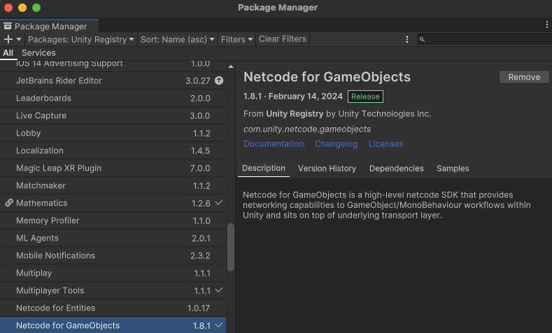
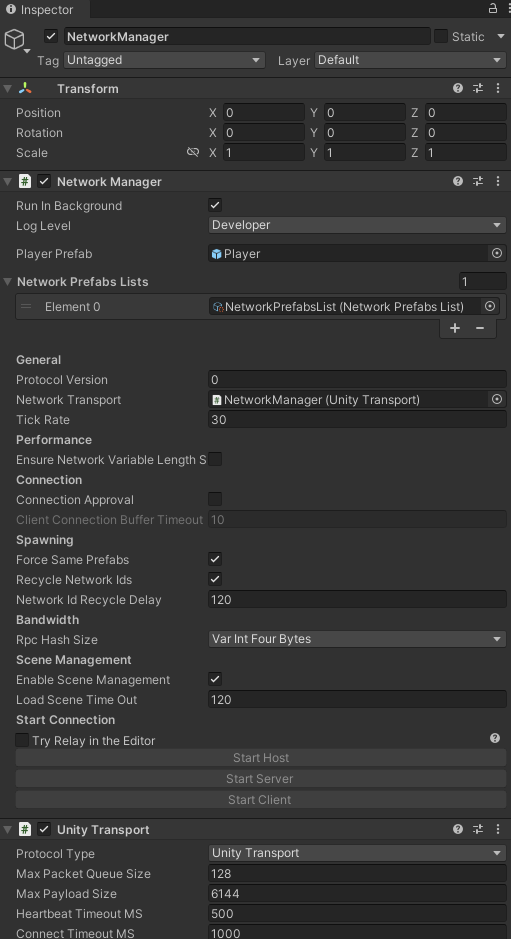
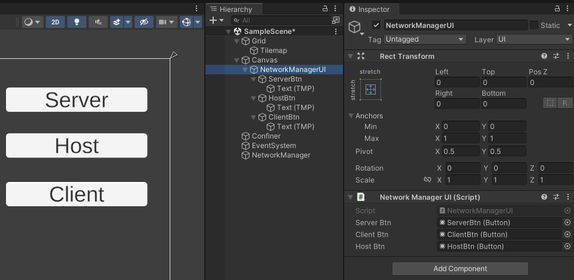
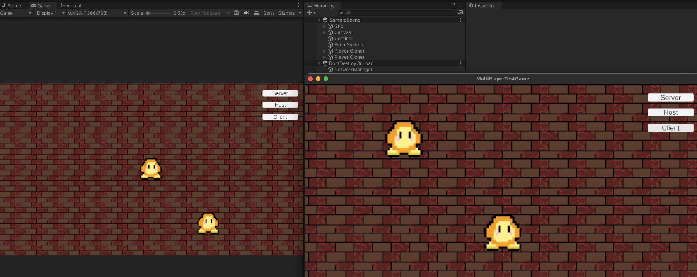
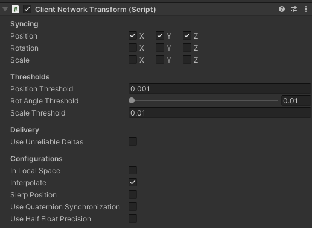

Netcode 설치부터, 기본적인 연결 설정에 관한 이야기.  
[COMPLETE Unity Multiplayer Tutorial (Netcode for Game Objects)](https://youtu.be/3yuBOB3VrCk?si=9TD1eJWv0TnM7b98) 의 내용을 정리한 글  
[https://github.com/hhjlim/Co-op-Game](https://github.com/hhjlim/Co-op-Game)  

&nbsp;
## 1. Netcode 설치  

아래 패키지를 설치.  
Unity 2021.3.10 이후 부터 지원된다.  

- Window -> Package Manager -> Unity Registry  
- **Netcode for GameObjects**
- **Multiplayer Tools**



  

&nbsp;
## 2. Network Manager 만들기

- Hierarchy 창에서 Create Empty -> 이름은 적당히 NetworkManager 로 지어주자.

- Add Component Netcode -> NetworkManager 추가

- Select transport 에서 UnityTransport 설정  

완성된 모습은 아래와 같다. prefab은 아래에서 추가 설명



&nbsp;
## 3. Player 추가

- Player 로 사용될 Prefab을 만들기위해서는 해당 오브젝트가 NetworkObject 이여야 한다.  

- Add Component -> Netcode -> NetworkObject  

- 만들어진 Player Prefab을 Network Manager 에 추가해주자.  

- 만약 추가가 안된다면 Network Prefabs Lists 가 설정되어 있는지 확인하자. (저는 수동으로 설정했습니다.)  

추가는 프로젝트 창에서 Assets 폴더 우클릭하고 Create -> Netcode -> Network Prefabs List  
  

여기 까지만 완료해도 Inspector 창에서 Start Host, Start Server, Start Client 버튼을 눌러서 실행시킬 수 있다.

다만 빌드된 실행파일에서는 저 버튼이 보이지 않기 때문에.. UI 를 만들어줄 필요가 있다.

&nbsp;
## 4. UI 만들기  

SerializeField 를 이용해서 모두 연결시켜주었고, (Drag & Drop). 

using Unity.Netcode; 를 추가해주면 NetworkManager 에 Singleton 으로  접근 가능하다.



- NetworkManagerUI - Script

```c#
using System.Collections;
using System.Collections.Generic;
using UnityEngine;
using UnityEngine.UI;
using Unity.Netcode; // 추가

public class NetworkManagerUI : MonoBehaviour
{
    [SerializeField] private Button serverBtn;
    [SerializeField] private Button clientBtn;
    [SerializeField] private Button hostBtn;

    private void Awake() {
        serverBtn.onClick.AddListener(() => {
            NetworkManager.Singleton.StartServer();
        });
        hostBtn.onClick.AddListener(() => {
            NetworkManager.Singleton.StartHost();
        });
        clientBtn.onClick.AddListener(() => {
            NetworkManager.Singleton.StartClient();
        });
    }

}
```

&nbsp;
## 5. 연결 성공

왼쪽이 Host, 오른쪽이 빌드된 실행파일에서 Client 로 접속하였다.



  
&nbsp;
## 6. NetworkBehaviour

이상태에서 Player 를 조작하면, 두 캐릭터가 동시에 움직이게된다.  
이를 방지하기위해 IsOwner 를 이용해서 실제 이 Player를 Spawn 한사람이 본인인지 확인한다.  

- NetworkManagerUI - Script  

```c#
using Unity.Netcode; // 추가
...
public class waddle_control : NetworkBehaviour { // Mono -> NetworkBehaviour 로 설정하자.
...
void Update(){
    if (!IsOwner) return; // Owner 확인
   
float speed = 10f;
float moveX = 0f;
float moveY = 0f;

if (Input.GetKey(KeyCode.W)) moveY = 1f;
if (Input.GetKey(KeyCode.S)) moveY = -1f;
if (Input.GetKey(KeyCode.A)) moveX = -1f;
if (Input.GetKey(KeyCode.D)) moveX = +1f;

Vector3 moveDir = new Vector3(moveX, moveY);
transform.position += moveDir * speed * Time.deltaTime;
}
```

&nbsp;
## 7.NetworkTransform

Player prefab 에 NetworkTransform 컴포넌트를 추가하여, 싱크를 맞춰주자.

2D 게임이라서 X, Y 만 전송해도 되고.. 게임에 따라 또 대역폭에 따라 싱크를 맞출 부분을 추가해주면 된다.

- Player Prefab -> Add Component -> Network Transform

&nbsp;
## 8.Client가 안움직여요 (Owner authoritative mode)

이 상태에서 빌드하면 Host 는 제대로 잘 움직이는데, Client는 움직이지 않는다. 

이유는 기본적으로 Host 는 Client가 보내는 정보를 신뢰하지 않기때문이다.

해결책은 2가지이다.

1. Client : Host 로 이동 명령을 보내고, Host는 그 요청을 수행하고, 결과를 Client로 전송한다.
2. Host : Client가 보내는 Player 좌표를 Accept 한다.

간단한 Co - op 게임이 목표이기 때문에.. 친구가 치트를 쓴다는 가정은 잠시 멈추고 Client를 신뢰해보도록 하자.

[공식문서](https://docs-multiplayer.unity3d.com/netcode/current/components/networktransform/)에서 Owner authoritative mode 의 설명을 따라해보자. **(a.k.a ClientNetworkTransform)**

- Windows -> PackageManager -> Add -> Add from git URL 아래주소를 입력

- https://github.com/Unity-Technologies/com.unity.multiplayer.samples.coop.git?path=/Packages/com.unity.multiplayer.samples.coop#main

추가된 모습은 아래와 같다.



&nbsp;
## 9.정리

- Player Prefab을 이용해서 사용자별로 Player Spawn

- 각각의 Player가 자신의 GameObject를 조작

다음 포스트에서는 카메라에 관한 이야기를 조금 해보고자 한다.