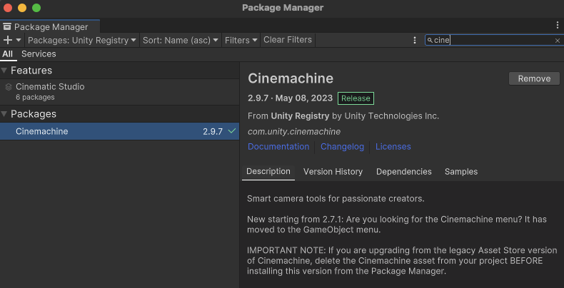
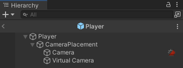
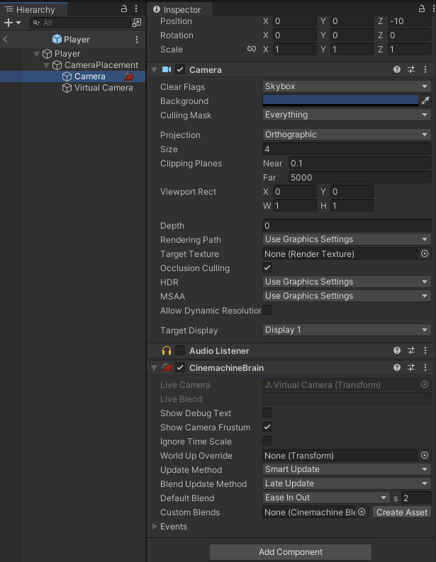
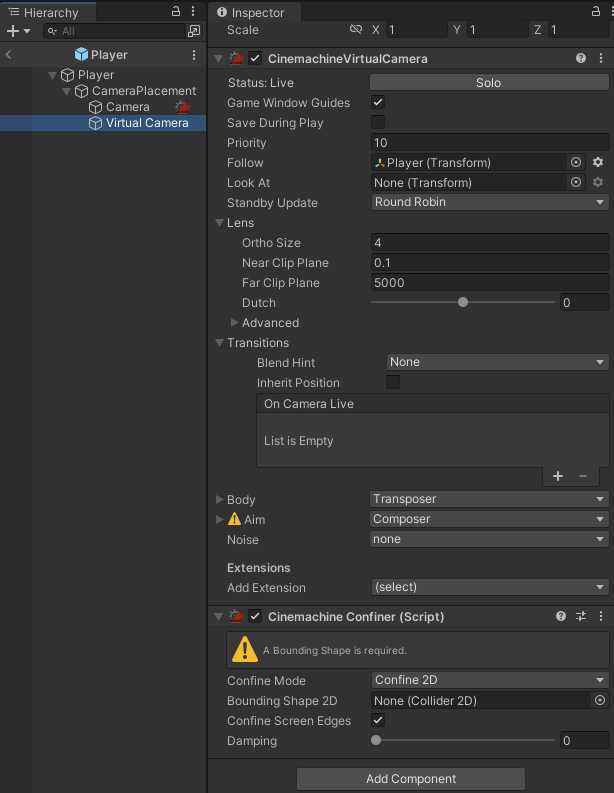
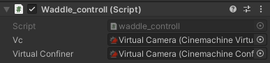
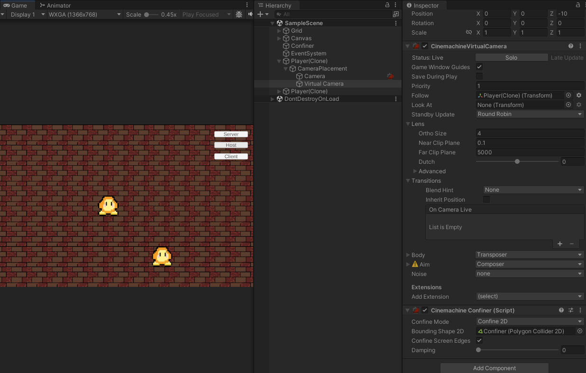
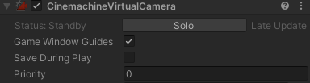

NetworkBehaviour Object에 Cinemachine 컴포넌트를 적용하는 이야기  
[NetCode For Game Objects Pt 5 - Cinemachine Cameras in Multiplayer](https://youtu.be/MvRtr8nUm_U?si=0GVkTthz6L6i57Fk)  
[https://github.com/hhjlim/Co-op-Game](https://github.com/hhjlim/Co-op-Game)  


&nbsp;
## 1. Cinemachine 설치  
Camera object에 Cinemachine 컴포넌트를 추가하여,  
Camera가 자신의 캐릭터를 따라가고,  
맵밖의 Grid 영역은 카메라가 비추지 않도록 카메라의 영역을 설정하고자 한다.  

- Window -> Package Manager -> Unity Registry  
- **Cinemachine**



  

&nbsp;
## 2. 생각해야 할 점  
일반적인 상황이라면 그저 Scene에 카메라를 추가하고, 컴포넌트를 추가하면 끝날 일이지만,  
각각의 Player가 각자의 Camera를 따라가야 하는 상황이다.  
따라서 아래와 같이 설계되어야 할것 같다.

- 준비된 **Player Prefab** 안에 Camera 오브젝트와 Virtual Camera를 만든다.
- 그리고 Camera에 Cinemachine brain 컴포넌트를 추가한다.  



&nbsp;
## 3. Camera에 Cinemachinebrain 컴포넌트 추가
CinemachineBrain 컴포넌트를 추가하고, Virtual Camera가 Live Camera로 설정되는지 확인하자.




&nbsp;
## 4. Virtual Camera에 Cinemachine Confiner 컴포넌트 추가
Cinemachine Confiner 는 Collider 2D object를 받아,  
Virtual Camera가 해당 2D 오브젝트 영역 밖으로 나가는 현상을 방지해준다.  
>다만, Collider 2D Object는 게임의 맵의 경계선에 해당되는 부분으로,  
>Player Prefab에 들어갈만한 내용은 아닌것 같다.  
>따라서 해당 값은 추후 Script에서 NetworkSpawn에서 설정해주자.  

지금은 Prefab 안에서는 None으로 설정해두자.




&nbsp;
## 5. Player Script 수정

수정해야할 사항은 아래와 같다.
1. 자신의 오브젝트일때, Virtual Camera의 Priority 높이기  
-> 유저마다 각자의 Virtual Camera가 가장 높은 Priority를 가지게한다.

2. NetworkSpawn에서 올바른 Collider 2D object 를 Cinemachine Confiner 로 할당한다.  
-> 맵의 바깥영역을 보이지 않게 한다.


```c#
using System.Collections;
using System.Collections.Generic;
using UnityEngine;
using Unity.Netcode;
using Cinemachine; //추가

public class waddle_controll : NetworkBehaviour {

    [SerializeField] private CinemachineVirtualCamera vc;
    [SerializeField] private CinemachineConfiner virtualConfiner;
    private GameObject target;

    public override void OnNetworkSpawn()
    {
        //2.Scene에서 Confiner 라는 오브젝트를 찾고, virtualConfiner에 할당해준다.
        target = GameObject.Find("Confiner"); 
        Collider2D collider = target.GetComponent<Collider2D>();
        virtualConfiner.m_BoundingShape2D = collider;

        if (IsOwner)
        {
            //1.만약 오브젝트의 Owner이면 Priority를 높여준다.
            vc.Priority = 1;
        }
        else
        {
            vc.Priority = 0;
        }
    }
```

- SerializeField 를 추가해주었으므로, 아래와 같이 Drag & Drop 하자.  

  
&nbsp;
## 6. OnNetworkSpawn()
  OnNetworkSpawn 함수는 Network Manager가 Player Prefab을 Spawn할때 1번 실행된다.  
  아래와 같이 정상적으로 Priority 와 Confiner가 할당되는지 확인해보자.  

- Host Player의 Virtual Camera Priority 1 및 Confiner 연결 완료.


- Host 입장에서 바라본 Client의 Player 의 Priority 는 0으로 설정되어 있다.  
(따라서 Host의 Virtual Camera 는 자신의 Player를 비추게 된다.)  



다음 Post 에서는 아래와 관련된 내용을 다루게 될것 같다. 
1. 애니메이션을 추가하는 내용
2. [SerializeField] private 에 관한 내용
3. GameObject.Find() 그리고 GetComponent<Collider2D>(); 와 같이 접근하는 내용