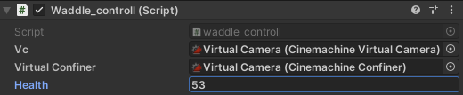

SerializeField에 관한 개념적인 이야기 

## What is SerializeField? and Why do we use it?
### 1. 일단 가장 먼저 이해 해야 할 것이 있다.  
- Unity 에디터에서 객체의 필드를 인스펙터 창에 노출시키기 위해서는 "**직렬화(Serialization)**"가 필수적이다.  

&nbsp;

###  2. "**직렬화(Serialization)**" 는 무슨뜻인가?  
- 객체나 데이터 구조를 저장하거나 전송하기 쉬운 형식으로 변환하고, 나중에 다시 재구성하는 과정을 의미
- 예를 들어, 유니티 에디터에서 GameObject의 속성을 설정할 때, 에디터를 닫았다가 다시 열 때 그 변경사항이 유지되기 위해서는, 직렬화된 데이터여야 한다.
- 게임의 저장기능이나, 네트워킹에서 사용하기 편리하다.  

&nbsp;

### 3. "**[SerializeField]**"는 언제 쓰이는가?  
-  Unity의 직렬화 과정에서 특정 필드를 직렬화하게 하면서,  
-  Unity 에디터의 인스펙터 창에도 노출시키는 역할
-  필드를 public으로 선언하지 않고도 에디터에서 접근하게 할 수 있는 방법
-  예를 들어, 클래스의 내부 구현을 보호하면서도, 게임 디자이너나 다른 개발자들이 에디터를 통해 게임 요소를 쉽게 조정할 수 있도록 한다.

&nbsp;

### 4. 간단한 예시
```c#
using UnityEngine;

public class ExampleScript : MonoBehaviour
{
    [SerializeField] private int health = 100; // private 이지만 인스펙터창에 보이게된다.
}
```
&nbsp;

- 아래 그림처럼 인스펙터 창에서 Private 요소에 접근 가능!  
- 마우스 드래그로 값도 쉽게 변경할 수 있다.  


