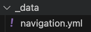
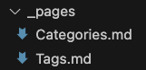

### 1. Clone minimal mistake 
```
git clone https://github.com/mmistakes/minimal-mistakes.git
```

### 2. 실제 사용하는 파일만 남기기  
- .github, test, .editorconfig, .gitattributes, .travis.yml, CHANGELOG.md README.md, screenshot 삭제  

- .gitignore 은 남겨주는게 편하다.

- docs 폴더는 다른곳으로 옮겨주었다. 예제 파일이라서 참고하기 좋음

### 3. 내 github repo master branch에 push 하기
```
git add .
git commit -m "<Message>"
git push -u origin master
```
- origin 설정 해주어야 함 

### 4. 카테고리를 추가하는 방법
- /_data/navigation.yml 파일 수정  



``` jsx
# main links
main:
  - title: "Home"
    url: /
  - title: "Category"
    url: /categories/
  - title: "Tags"
    url: /tags/
```
   
- navigation에 추가해준 카테고리에 대해  
 url 페이지 만들기   
 _pages 폴더 하위에 Categories.md Tags.md 파일 추가



``` jsx
---
title: "Posts by Category"
layout: categories
permalink: /categories/
author_profile: true
---
```

``` jsx 
---
title: "Posts by Tag"
permalink: /tags/
layout: tags
author_profile: true
---
```


### 5 로컬 서버에서 잘 동작하는지 확인
```
bundle exec jekyll build
bundle exec jekyll serve
```